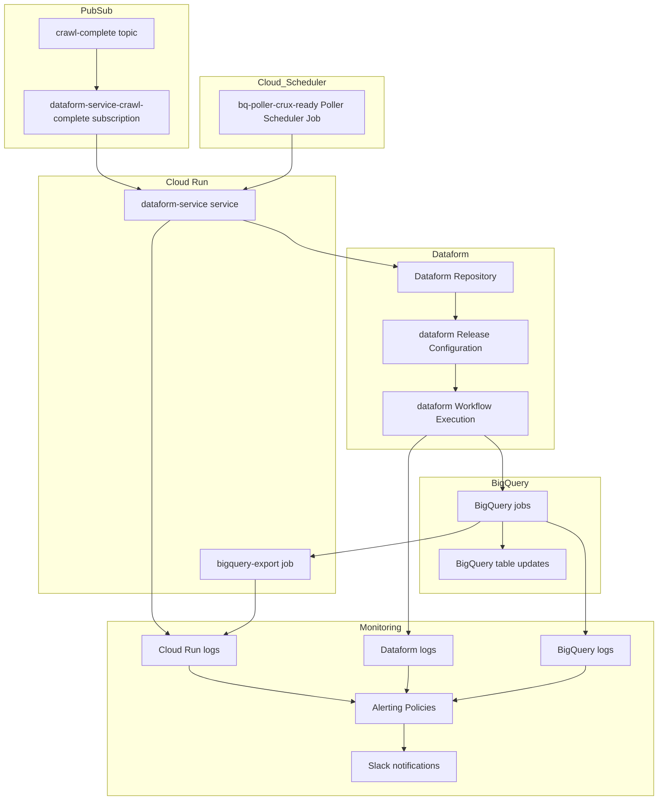

# Tech Report APIs & Pipelines Monorepo

Welcome to the **Tech Report APIs & Pipelines** monorepo. This central repository (powered by [Turborepo](https://turbo.build/)) handles both the HTTP Archive dataset processing pipelines and the public reporting API endpoints.

---

## Repository Structure

This workspace is organized into separate applications (`apps/`) and reusable packages (`packages/`):

```
tech-report-apis/
├── apps/
│   ├── report-api/          # REST and MCP Reporting API for CrUX, Lighthouse, and CWV metrics
│   ├── dataform-service/    # Triggering and poller service for Dataform compile/release runs
│   └── bigquery-export/     # Cloud Run Job for exporting aggregated dataset results from BigQuery
├── packages/
│   ├── shared/              # Common utility functions, database connectors, and logging modules
│   ├── eslint-config/       # Unified ESLint configurations
│   └── jest-config/         # Shared Jest configuration defaults
├── terraform/               # Production IaC (Infrastructure-as-Code) Terraform configurations
└── .github/                 # Workflows for linting, testing, and automated deployment
```

---

## Pipelines Overview

Our data pipelines process the monthly HTTP Archive crawl runs, saving them into Google BigQuery datasets.

### 1. HTTP Archive Crawl
* **Tag**: `crawl_complete`
* **Dataset**: `httparchive.crawl.*`
* **Consumers**: Public dataset and the [BQ Sharing Listing](https://console.cloud.google.com/bigquery/analytics-hub/discovery/projects/httparchive/locations/us/dataExchanges/httparchive/listings/crawl)

### 2. HTTP Archive Technology Report
* **Tag**: `crux_ready`
* **Dataset**: `httparchive.reports.cwv_tech_*` and `httparchive.reports.tech_*`
* **Consumers**: [HTTP Archive Tech Report](https://httparchive.org/reports/techreport/landing)

---

## Schedules & Triggering Workflows

Workflows are scheduled and orchestrated automatically using GCP event-driven triggers:

1. **[crawl-complete](https://console.cloud.google.com/cloudpubsub/subscription/detail/dataform-service-crawl-complete?authuser=2&project=httparchive) Pub/Sub Subscription**
   * **Target Workspace**: `dataform-service`
   * **Tags Triggered**: `["crawl_complete"]`

2. **[bq-poller-crux-ready](https://console.cloud.google.com/cloudscheduler/jobs/edit/us-central1/bq-poller-crux-ready?authuser=7&project=httparchive) Scheduler**
   * **Target Workspace**: `dataform-service` (Poller Job)
   * **Tags Triggered**: `["crux_ready"]`

### Workflow Orchestration
We use a unified Cloud Run function ([dataform-service](./apps/dataform-service/)) to handle triggers. It performs intermediate state checks, compiles the Dataform configs, and initiates execution configurations.

---

## Cloud Resources Overview

The following system architecture diagram illustrates how our monorepo components interface with Google Cloud services:



---

## Monorepo Development Setup

### Prerequisites
* **Node.js**: 24+
* **Package Manager**: npm

### Installation
Install dependencies globally for the workspace to link internal packages (like `@httparchive/shared`):
```bash
npm install
```

### Global Commands (Turborepo)
Run tasks across all applications and workspaces concurrently:

* **Build all workspaces**:
  ```bash
  npx turbo run build
  ```
* **Lint the whole codebase**:
  ```bash
  npx turbo run lint
  ```
* **Run all unit tests**:
  ```bash
  npx turbo run test
  ```

---

## App Documentation

Refer to sub-app documentation for detailed endpoints and service configurations:
* [Report API (REST/MCP Endpoints)](./apps/report-api/README.md)
* [Dataform Service (Triggering & Orchestration)](./apps/dataform-service/README.md)
* [BigQuery Export (Cloud Run Job Setup)](./apps/bigquery-export/README.md)
* [Terraform Infrastructure-as-Code Configuration](./terraform/README.md)
