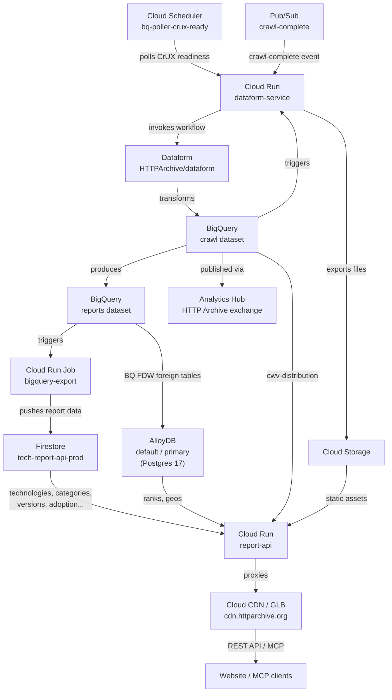

# Infrastructure Overview

## Architecture

## Components

| Component | Service | Repository / Config |
| --- | --- | --- |
| Workflow orchestration | Cloud Run (`dataform-service`) | `tech-report-apis/terraform/dataform-service/` |
| Dataform pipelines | Dataform (`HTTPArchive/dataform`) | `dataform/` |
| BigQuery export | Cloud Run Job (`bigquery-export`) | `tech-report-apis/terraform/bigquery-export/` |
| Public data sharing | Analytics Hub | `tech-report-apis/terraform/data_exchange.tf` |
| AlloyDB cluster + instance | AlloyDB Postgres 17, `n2-highmem-8` | `tech-report-apis/terraform/database/` |
| Report API | Cloud Run (`report-api`) | `tech-report-apis/terraform/run-service/` |
| CDN / Load Balancer | Cloud CDN + GLB | `tech-report-apis/terraform/cdn-glb/` |
| IAM bindings | Google IAM | `tech-report-apis/terraform/iam.tf` |
| Alerting | Cloud Monitoring | `tech-report-apis/terraform/monitoring.tf` |

## Data Sources per API Endpoint

| Endpoint | Backend |
| --- | --- |
| `/technologies`, `/categories`, `/versions` | Firestore (`tech-report-api-prod`) |
| `/ranks`, `/geos` | AlloyDB (`tech_report_ranks`, `tech_report_geos`) |
| `/cwv-distribution` | BigQuery (`crawl` dataset, direct query) |
| `/adoption`, `/cwv`, `/lighthouse`, `/page-weight` | Firestore (`tech-report-api-prod`) |
| Static assets | Cloud Storage (GCS) |

## AlloyDB & BigQuery FDW

Some tables in the `reports` BigQuery dataset are exposed to AlloyDB via the built-in `bigquery_fdw` extension. AlloyDB handles Postgres connections; BigQuery handles all analytical computation. The `report-api` connects via AlloyDB Auth Proxy (IAM auth, no password).

See SQL setup script in [`database/main.tf`](../terraform/database/main.tf) (block comment at the bottom).

## Trigger Flow

1. **CrUX data ready** → Cloud Scheduler polls → `dataform-service` invoked
2. **New crawl data in `crawl` dataset** → triggers `dataform-service` → Dataform workflow runs → `crawl` dataset transformed into `reports` dataset; files exported to GCS
3. **`reports` dataset updated** → triggers `bigquery-export` → pushes report data to Firestore; `crawl` dataset published via Analytics Hub
4. **AlloyDB** serves `ranks` and `geos` from report tables via BigQuery FDW
