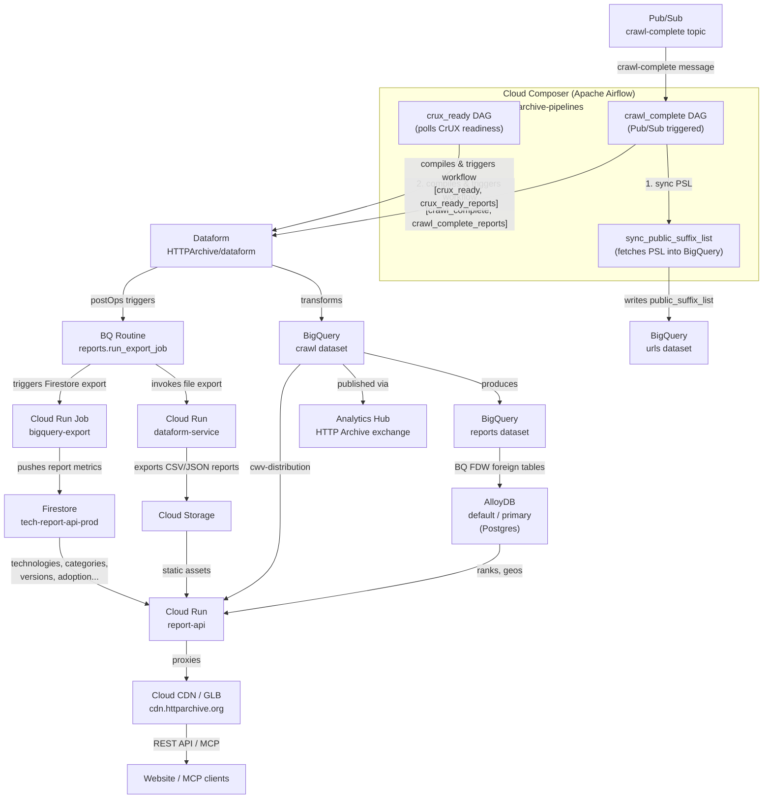

# Infrastructure Overview

## Architecture

```mermaid
flowchart TD
    subgraph Airflow["Cloud Composer (Apache Airflow)\nhttparchive-pipelines"]
        DAG_CRUX["crux_ready DAG\n(polls CrUX readiness)"]
        DAG_CRAWL["crawl_complete DAG\n(Pub/Sub triggered)"]
        PSL_TASK["sync_public_suffix_list\n(fetches PSL into BigQuery)"]
    end

    PS["Pub/Sub\ncrawl-complete topic"]
    DF["Dataform\nHTTPArchive/dataform"]
    BQ_URLS["BigQuery\nurls dataset"]
    BQ_CRAWL["BigQuery\ncrawl dataset"]
    BQ_REPORTS["BigQuery\nreports dataset"]
    ROUTINE["BQ Routine\nreports.run_export_job"]
    DS["Cloud Run\ndataform-service"]
    BQ_EXPORT["Cloud Run Job\nbigquery-export"]
    AH["Analytics Hub\nHTTP Archive exchange"]
    FS["Firestore\ntech-report-api-prod"]
    ALLOY["AlloyDB\ndefault / primary\n(Postgres)"]
    GCS["Cloud Storage"]
    API["Cloud Run\nreport-api"]
    CDN["Cloud CDN / GLB\ncdn.httparchive.org"]
    CLIENTS["Website / MCP clients"]

    PS -->|"crawl-complete message"| DAG_CRAWL
    DAG_CRAWL -->|"1. sync PSL"| PSL_TASK
    PSL_TASK -->|"writes public_suffix_list"| BQ_URLS
    DAG_CRAWL -->|"2. compiles & triggers workflow\n[crawl_complete, crawl_complete_reports]"| DF
    DAG_CRUX -->|"compiles & triggers workflow\n[crux_ready, crux_ready_reports]"| DF

    DF -->|"transforms"| BQ_CRAWL
    BQ_CRAWL -->|"produces"| BQ_REPORTS
    BQ_REPORTS -->|"BQ FDW foreign tables"| ALLOY
    BQ_CRAWL -->|"published via"| AH

    DF -->|"postOps triggers"| ROUTINE
    ROUTINE -->|"invokes file export"| DS
    ROUTINE -->|"triggers Firestore export"| BQ_EXPORT
    DS -->|"exports CSV/JSON reports"| GCS
    BQ_EXPORT -->|"pushes report metrics"| FS

    FS -->|"technologies, categories,\nversions, adoption..."| API
    ALLOY -->|"ranks, geos"| API
    BQ_CRAWL -->|"cwv-distribution"| API
    GCS -->|"static assets"| API
    API -->|"proxies"| CDN
    CDN -->|"REST API / MCP"| CLIENTS
```

## Components

| Component | Service | Repository / Config |
| --- | --- | --- |
| Workflow orchestration | Cloud Composer (`httparchive-pipelines`) | `tech-report-apis/terraform/airflow.tf` & `dataform/airflow/dags/` |
| Dataform pipelines | Dataform (`HTTPArchive/dataform`) | `dataform/` |
| GCS File exports | Cloud Run (`dataform-service`) | `tech-report-apis/terraform/dataform-service/` |
| BigQuery export (Firestore) | Cloud Run Job (`bigquery-export`) | `tech-report-apis/terraform/bigquery-export/` |
| Public data sharing | Analytics Hub | `tech-report-apis/terraform/data_exchange.tf` |
| AlloyDB cluster + instance | AlloyDB Postgres 18, `n2-highmem-2` | `tech-report-apis/terraform/database/` |
| Report API | Cloud Run (`report-api`) | `tech-report-apis/terraform/run-service/` |
| CDN / Load Balancer | Cloud CDN + GLB (`cdn.httparchive.org`) | `tech-report-apis/terraform/cdn-glb/` |
| IAM bindings | Google IAM | `tech-report-apis/terraform/iam.tf` |
| Alerting | Cloud Monitoring | `tech-report-apis/terraform/monitoring.tf` |

## Data Sources per API Endpoint

| Endpoint | Backend |
| --- | --- |
| `/technologies`, `/categories`, `/versions` | Firestore (`tech-report-api-prod`) |
| `/ranks`, `/geos` | AlloyDB (`tech_report_ranks`, `tech_report_geos`) |
| `/cwv-distribution` | BigQuery (`crawl` dataset, direct query) |
| `/adoption`, `/cwv`, `/lighthouse`, `/page-weight` | Firestore (`tech-report-api-prod`) |
| Static assets | Cloud Storage (GCS) |
